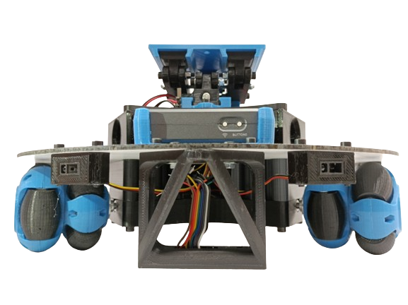

# MINAIRÓ V1.0 Robot
El robot Minairó es un proyecto *opensource* de robot didáctico, diseñado para aprender a programar de una manera divertida, proporcionando una plataforma *hardware* capaz de intreractuar mediante sensores y actuadores electrónicos [google][1].


## Métodos para comunicaciones: [->](#item1)
```
- MinairoSocket(IP,port)
- run():
- transmit():
- stop():
- close():
- setPullingTime(x):
- getPullingTime():
```
## Métodos para control:
```
- setVel(x,y,w):
- setX(x):
- setY(y):
- setW(w):
```
## Métodos para el seguidor de líneas:
```
- setSensorLine_Threshold(x):
- getSensorLine_Threshold():
- getSensorLine_Analog():
- getSensorLine_Digital():
```
## Método para los sensores perimetrales:
```
- getSensorSharp():
```
## Métodos para las GPIOs:
```
- confGPIO(pin,mode):
- setGPIO(pin,value):
- getGPIO():
```
## Método para entradas analógicas:
```
getAnalogs()
```
## Método para servos RC:
```
- setSERVO(pin,value):
```
## Método par SONAR:
```
- getSONAR():
```
---
---
<a name="item1"></a>
## Métodos para comunicaciones:
### `MinairoSocket(IP,port)`
#### Descripción
Crea una instancia del Robot MINAIRÓ. En ella se incluyen todos los métodos para controlar el robot y monitorizar todos los sensores.

#### Sintaxis

```
MinairoSocket(IP,port)
```

#### Paràmetros
**IP**: Dirección IP del Robot MINAIRÓ. Por defecto 192.168.1.1.

**port**: Puerto para establecer el *socket* de comunicación. Por defecto *22*.

#### Ejemplo

```
from Minairo_TCP import *
from time import sleep

if __name__=="__main__":
    IP = '192.168.1.1'
    port = 22
    Robot = MinairoSocket(IP,port)
    Robot.run()
    Robot.setX(0.1)
    sleep(2)
    Robot.setX(0.0)
    sleep(0.5)
    Robot.close()
```


